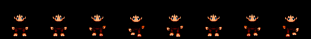
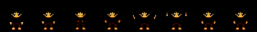
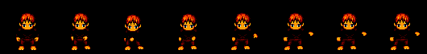
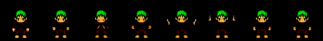
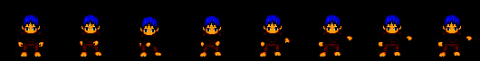
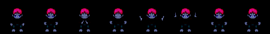
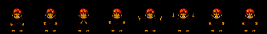
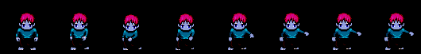
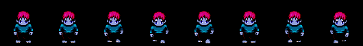

# Disentangled Sequential Autoencoder
PyTorch implementation of [Disentangled Sequential Autoencoder](https://arxiv.org/abs/1803.02991), a Variational Autoencoder Architecture for learning latent representations of high dimensional sequential data by approximately disentangling the time invariant and the time variable features. 

## Results
We test our network on the [Liberated Pixel Cup](https://github.com/jrconway3/Universal-LPC-spritesheet) dataset consisting of sprites of video game characters of varying hairstyle, clothing, skin color and pose. We constrain ourselves to three particular types of poses, walking, slashing and spellcasting. The network learns disentangled vector representations for the static (elements like skin color and hair color) and dynamic aspects (motion) in the vectors f, and z1, z2, z3, .. z8 (one for each frame), respectively

### Style Transfer
We perform style transfer by learning the f and z  encodings of two characters that differ in both appearance and pose, and swap their z encodings. This causes the characters to interchange their pattern of motion while preserving appearance ,allowing manipulations like "blue dark elf walking" swapped with "lightskinned human spellcasting" gives "blue dark elf spellcasting" and "lightskinned human walking" respectively

<table align='center'>
<tr align='center'>
<td>Sprite 1</td>
<td>Sprite 2</td>
<td>Sprite 1's Body With Sprite 2's Pose</td>
<td>Sprite 2's Body With Sprite 1's Pose</td>
</tr>
<tr>
<td height="200%"></td>
<td height="200%"></td>
<td height="200%"></td>
<td height="200%"></td>
</tr>
<tr>
<td height="200%"></td>
<td height="200%"></td>
<td height="200%"></td>
<td height="200%"></td>
</tr>
<tr>
<td height="200%"></td>
<td height="200%"></td>
<td height="200%"></td>
<td height="200%"></td>
</tr>
<tr>
<td height="200%"></td>
<td height="200%"></td>
<td height="200%"></td>
<td height="200%"></td>
</tr>
<tr>
<td height="200%"></td>
<td height="200%"></td>
<td height="200%"></td>
<td height="200%"></td>
</tr>
<tr>
<td height="200%"></td>
<td height="200%"></td>
<td height="200%"></td>
<td height="200%"></td>
</tr>
<tr>
<td height="200%"></td>
<td height="200%"></td>
<td height="200%"></td>
<td height="200%"></td>
</tr>
</table>

### Cosine Similarities of Encodings
We consider 12 pairs of randomly chosen sprites and compare the cosine similarities of their f and z encoding vectors. We observe that sprites having the same physical appearance have a high cosine similarity between their f encodings irrespective of whether their motion patterns are same or different and sprites having different physical appearance have a low cosine similarity between their f encodings
Similarly sprites having similar motion patterns have a high cosine similarity between their z encodings irrespective of their appearance, and sprites having dissimilar motion patterns have a low cosine similaritiy of z encodings
This further reinforces the fact that f encodes the time invariant features of the sprites while the z vectors encode the time variable features

<table align='center'>
<tr align='center'>
<td>Sprite 1</td>
<td>Sprite 2</td>
<td>Cosine Similarity of f</td>
<td>Cosine Similarity of z</td>
</tr>
<tr>
<td></td>
<td></td>
<td>1.00</td>
<td>1.00</td>
</tr>
<tr>
<td></td>
<td></td>
<td>0.83</td>
<td>0.09</td>
</tr>
<tr>
<td></td>
<td></td>
<td>0.78</td>
<td>0.06</td>
</tr>
<tr>
<td></td>
<td></td>
<td>0.19</td>
<td>0.95</td>
</tr>
<tr>
<td></td>
<td></td>
<td>0.26</td>
<td>0.97</td>
</tr>
<tr>
<td></td>
<td></td>
<td>0.18</td>
<td>0.97</td>
</tr>
<tr>
<td></td>
<td></td>
<td>0.25</td>
<td>0.99</td>
</tr>
<tr>
<td></td>
<td></td>
<td>0.31</td>
<td>0.98</td>
</tr>
<tr>
<td></td>
<td></td>
<td>0.00</td>
<td>0.97</td>
</tr>
<tr>
<td></td>
<td></td>
<td>0.75</td>
<td>0.08</td>
</tr>
<tr>
<td></td>
<td></td>
<td>0.83</td>
<td>0.03</td>
</tr>
<tr>
<td></td>
<td></td>
<td>0.73</td>
<td>0.08</td>
</tr>
</table>
